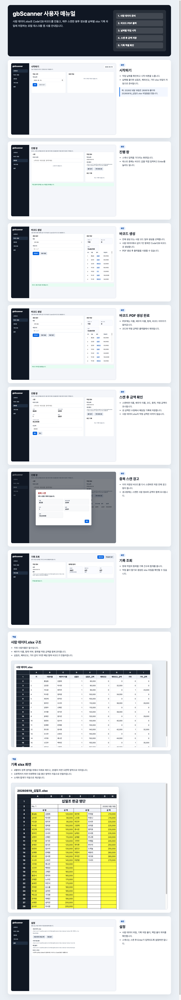
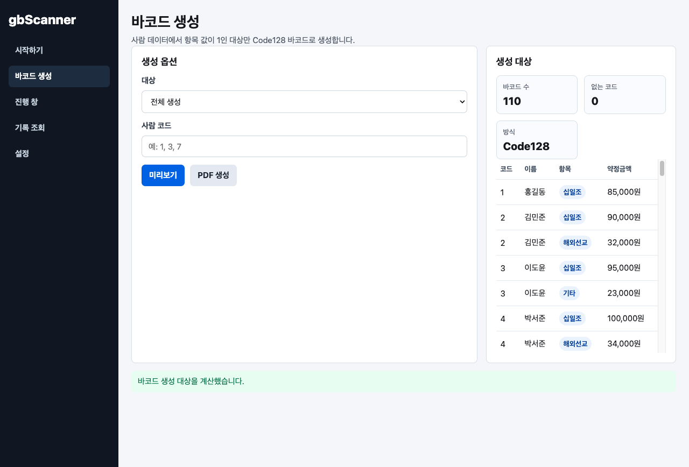
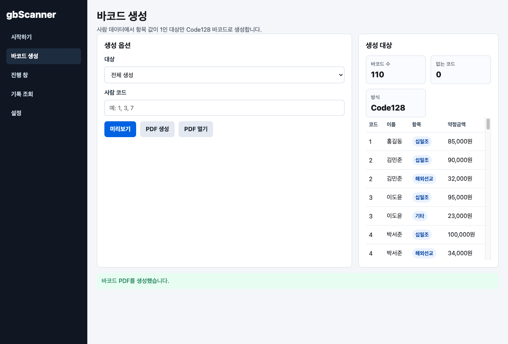
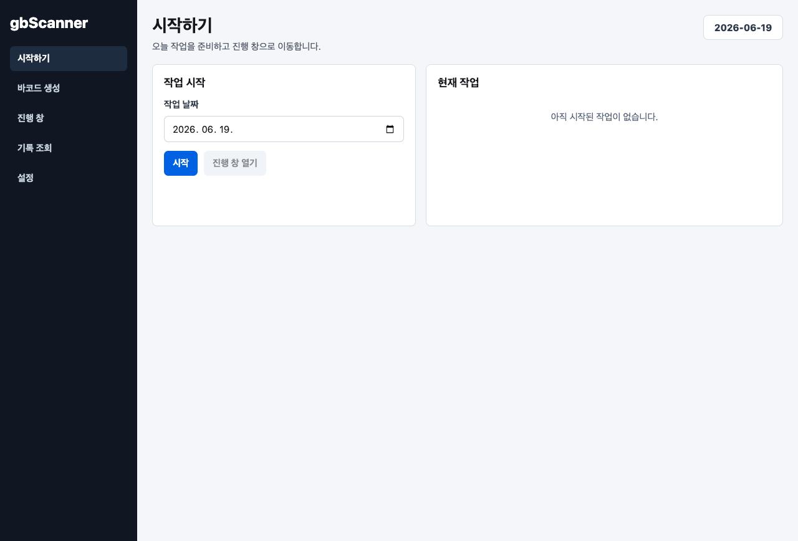
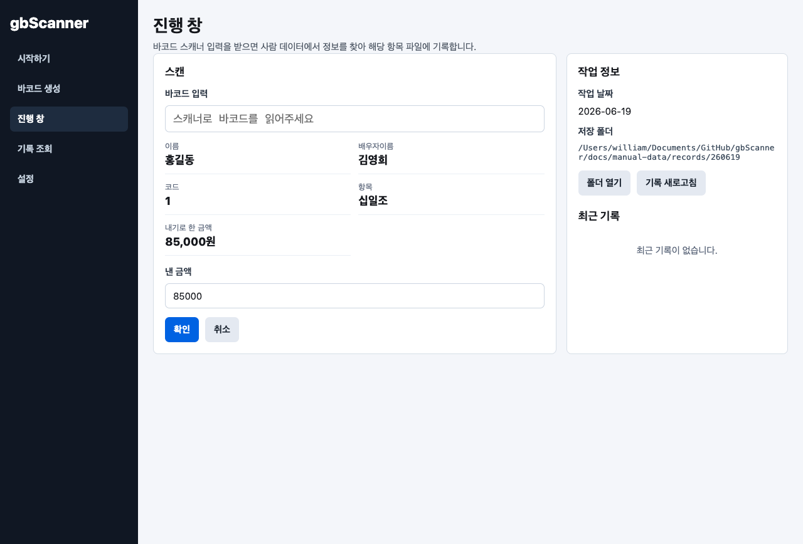
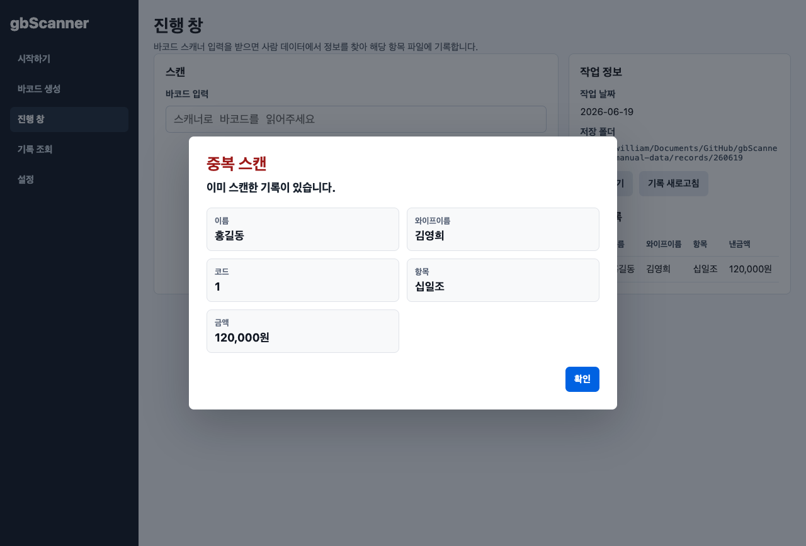
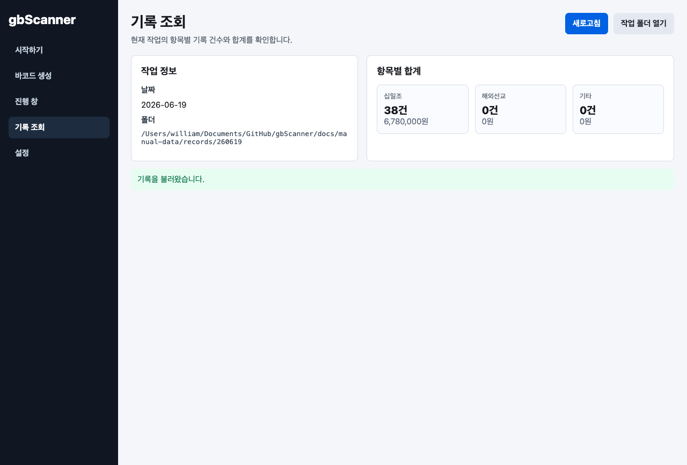
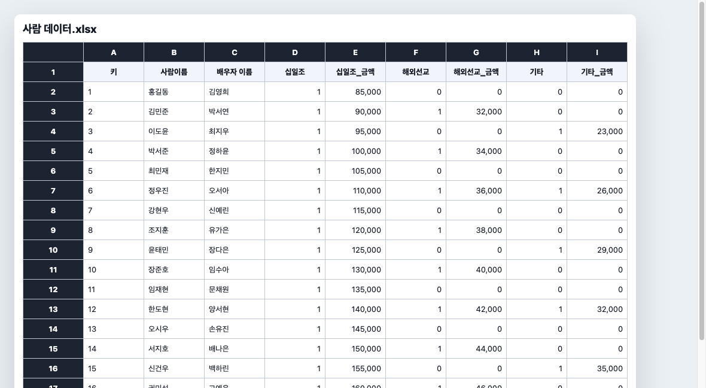
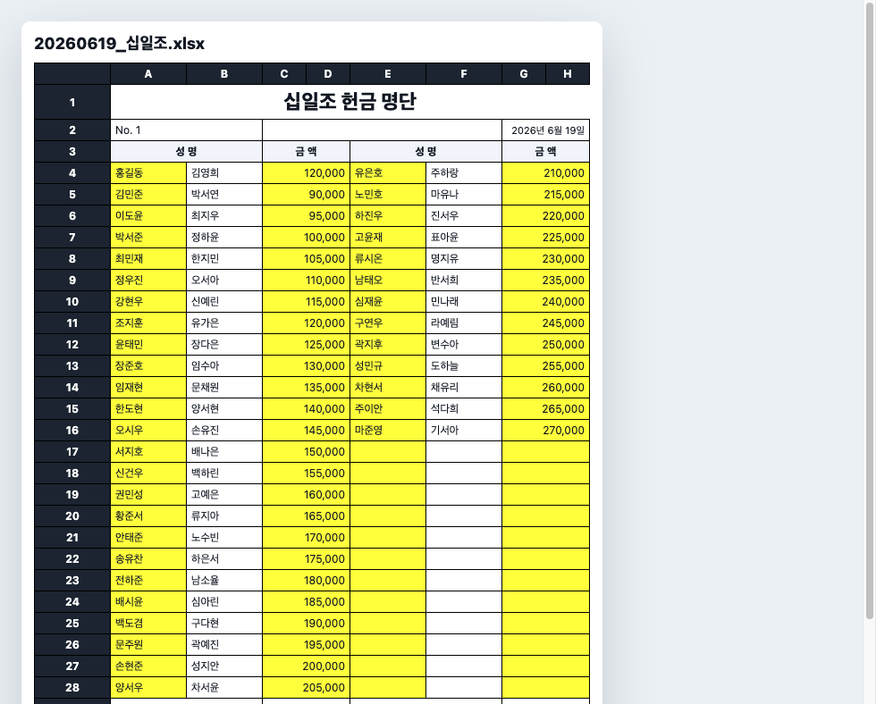

# gbScanner

gbScanner는 교회 헌금 봉투의 바코드를 스캔해 날짜별 헌금 명단 xlsx 파일을 자동으로 만드는 로컬 데스크톱 앱입니다. 브라우저 서비스가 아니라 Electron 기반 앱으로 동작하며, 모든 데이터는 사용자의 PC 안에 있는 xlsx 파일과 로컬 폴더에만 저장됩니다.



## 사용자 매뉴얼

- 이미지 한 장으로 보는 전체 매뉴얼: [docs/USER_MANUAL.png](docs/USER_MANUAL.png)
- 문서형 매뉴얼: [docs/USER_MANUAL.md](docs/USER_MANUAL.md)
- 브라우저에서 보기 좋은 HTML 매뉴얼: [docs/USER_MANUAL.html](docs/USER_MANUAL.html)
- 개별 화면 캡처: [docs/manual-images](docs/manual-images)

## 서비스 개요

사람 데이터.xlsx에는 각 사람의 고유 키, 이름, 배우자 이름, 십일조/해외선교/기타 참여 여부, 항목별 약정 금액이 들어갑니다. gbScanner는 이 정보를 읽어서 Code128 바코드를 만들고, 매주 봉투에 붙은 바코드를 스캔해 해당 날짜의 기록 xlsx 파일에 납부 금액을 추가합니다.

핵심 흐름은 다음과 같습니다.

1. `사람 데이터.xlsx`를 준비합니다.
2. 십일조, 해외선교, 기타 값이 1인 항목만 바코드로 생성합니다.
3. 생성된 바코드를 PDF로 출력해 봉투에 붙입니다.
4. 매주 앱에서 작업 날짜를 선택하고 시작합니다.
5. 봉투 바코드를 스캔하면 사람과 항목, 약정 금액이 화면에 표시됩니다.
6. 실제 납부 금액을 확인하거나 수정한 뒤 저장합니다.
7. 날짜별, 항목별 xlsx 파일에 기록이 추가됩니다.

## 주요 기능

### Code128 바코드 생성



- 바코드는 Code128만 사용합니다.
- 전체 인원 기준으로 한 번에 생성할 수 있습니다.
- 사람 코드를 직접 입력해 일부 인원만 생성할 수 있습니다.
- 사람 데이터에서 해당 항목 값이 1인 경우에만 바코드가 만들어집니다.
- 바코드 내부 값은 나중에 사람과 항목을 다시 찾을 수 있는 고유값입니다.

### 바코드 PDF 출력



- 생성 대상 바코드를 하나의 PDF로 출력합니다.
- 출력물에는 이름, 배우자 이름, 항목, 바코드 이미지가 들어갑니다.
- 코드와 약정 금액은 바코드 출력물에서 제외됩니다.

### 날짜별 작업 시작



작업 날짜를 선택하고 시작하면 날짜 폴더와 항목별 xlsx 파일이 자동으로 준비됩니다.

예를 들어 `2026-06-19` 작업을 시작하면 아래와 같은 구조가 만들어집니다.

```text
records/
  260619/
    20260619_십일조.xlsx
    20260619_해외선교.xlsx
    20260619_기타.xlsx
```

### 스캔 후 금액 확인



- 바코드를 스캔하면 이름, 배우자 이름, 코드, 항목, 약정 금액이 표시됩니다.
- 스캐너가 없을 때는 바코드 값을 직접 입력하고 Enter를 눌러 테스트할 수 있습니다.
- 약정 금액은 사람 데이터에 저장된 참고값입니다.
- 화면에서 수정하는 금액은 해당일 납부 금액이며, 사람 데이터.xlsx의 약정 금액은 바뀌지 않습니다.
- 확인을 누르면 해당 항목의 날짜별 xlsx 파일에 새 기록이 추가됩니다.

### 중복 스캔 방지



같은 날짜와 같은 항목 파일에 이미 저장된 바코드를 다시 스캔하면 저장 전에 경고창이 뜹니다. 경고창에는 에러 코드 대신 이미 스캔한 기록이 있다는 안내와 스캔한 사람 정보가 표시됩니다.

### 기록 조회



- 현재 작업의 항목별 기록 건수와 합계를 확인할 수 있습니다.
- 작업 폴더를 바로 열어 생성된 xlsx 파일을 확인할 수 있습니다.

## 엑셀 파일 구조

### 사람 데이터.xlsx



사람 데이터.xlsx는 앱이 바코드를 만들고 스캔 정보를 조회하는 기준 파일입니다.

필수 컬럼:

- `키`: 사람을 구분하는 고유 코드
- `사람이름`: 본인 이름

선택 컬럼:

- `배우자 이름`: 배우자 또는 와이프 이름
- `십일조`, `해외선교`, `기타`: 해당 항목을 사용하면 1
- `십일조_금액`, `해외선교_금액`, `기타_금액`: 항목별 약정 금액

지원하는 컬럼명 별칭:

- 키: `키`, `코드`
- 이름: `사람이름`, `사람 이름`, `이름`
- 배우자 이름: `배우자이름`, `배우자 이름`, `와이프이름`, `와이프 이름`
- 금액: `십일조_금액`, `십일조금액`, `십일조 금액` 형식처럼 공백 또는 밑줄 변형을 지원합니다.

### 기록 xlsx



기록 파일은 사용자가 지정한 날짜와 항목에 따라 자동 생성됩니다.

- 1행에는 `십일조 헌금 명단`, `해외선교 헌금 명단`, `기타 헌금 명단` 같은 제목이 들어갑니다.
- 2행 오른쪽에는 작업 날짜가 들어갑니다.
- 3행에는 `성명`, `금액`, `성명`, `금액` 헤더가 들어갑니다.
- 4행부터 왼쪽 영역을 위에서 아래로 채웁니다.
- 왼쪽 25명이 차면 오른쪽 영역으로 이어집니다.
- 한 화면의 오른쪽 영역까지 차면 아래쪽에 새로운 명단 영역이 자동으로 만들어집니다.
- 소계와 합계는 자동으로 계산됩니다.
- 중복 스캔 확인을 위해 숨김 메타 시트에 바코드 정보가 함께 저장됩니다.

## 설치와 실행

개발 환경에서 실행:

```bash
npm install
npm start
```

매뉴얼 이미지 재생성:

```bash
npm run manual
```

패키징 검증:

```bash
npm run pack
```

## 앱 빌드

macOS dmg와 Windows x64 exe를 모두 생성:

```bash
npm run build
```

개별 빌드:

```bash
npm run build:mac
npm run build:win
```

빌드 결과는 `dist/`에 생성됩니다. `build:win`은 Windows x64 NSIS 설치 파일을 만들도록 설정되어 있습니다. macOS에서 Windows exe를 만들 때는 `electron-builder`가 요구하는 Windows 빌드 환경 또는 Wine이 필요할 수 있습니다.

## 앱 아이콘

서비스 아이콘은 루트의 `아이콘.png`를 기준으로 빌드 리소스를 생성했습니다.

- macOS: `build/icon.icns`
- Windows: `build/icon.ico`
- 공통 PNG: `build/icon.png`

Electron Builder 설정에서 macOS와 Windows 빌드 모두 해당 아이콘을 사용합니다.

## 프로젝트 구조

```text
src/
  main/                 Electron main process, xlsx 처리, 바코드/PDF/기록 서비스
  preload/              renderer에서 사용할 안전한 IPC API
  renderer/             데스크톱 앱 화면
docs/
  USER_MANUAL.md        사용자 매뉴얼 Markdown
  USER_MANUAL.html      사용자 매뉴얼 HTML
  USER_MANUAL.png       한 장짜리 이미지 매뉴얼
  manual-images/        앱 화면과 엑셀 화면 캡처
scripts/
  generate-user-manual.js
build/
  icon.icns
  icon.ico
  icon.png
```

## 로컬 데이터와 Git 제외 대상

아래 폴더는 실제 운영 데이터 또는 빌드 산출물이므로 Git에 올리지 않도록 `.gitignore`에 포함되어 있습니다.

- `records/`: 날짜별 기록 xlsx
- `output/`: 바코드 PDF 등 출력물
- `backups/`: 기록 저장 전 백업 파일
- `config/`: 로컬 설정과 바코드 검증 secret
- `dist/`: 빌드 결과물
- `docs/manual-data/`: 매뉴얼 캡처 생성용 임시 데이터

## 운영 시 주의사항

- 실제 작업 전 `사람 데이터.xlsx`의 키가 중복되지 않았는지 확인하세요.
- 바코드 스캐너는 스캔 후 Enter가 입력되도록 설정하는 것을 권장합니다.
- 기록 저장 시 파일을 백업한 뒤 xlsx를 다시 쓰므로, 작업 중 같은 기록 파일을 Excel에서 열어둔 상태로 저장하면 충돌이 날 수 있습니다.
- `config/app-secret.json`이 바뀌면 기존 바코드 검증값과 맞지 않을 수 있으므로 운영 중에는 `config/` 폴더를 임의로 삭제하지 않는 것이 좋습니다.
