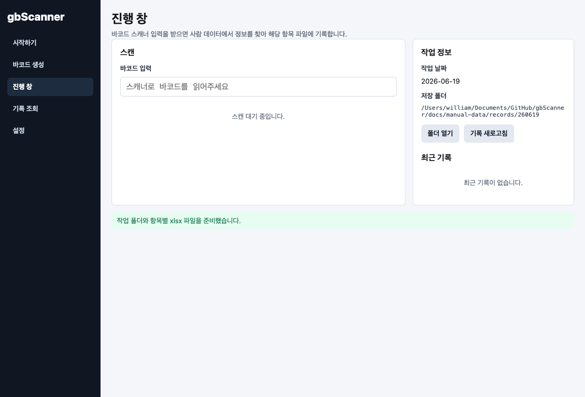
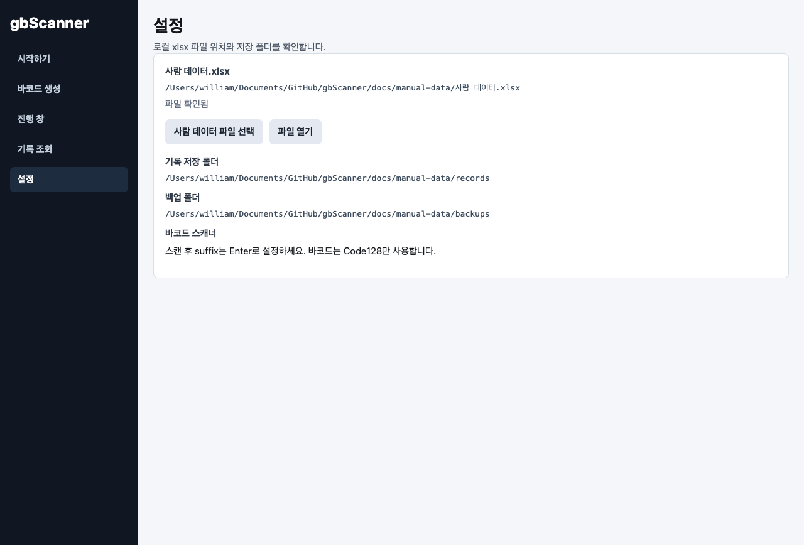

# gbScanner 사용자 매뉴얼

이 문서는 로컬 xlsx 파일을 기준으로 바코드를 만들고, 실제 스캔 결과를 날짜별 기록 파일에 저장하는 전체 흐름을 설명합니다.

## 1. 시작하기

- 작업 날짜를 확인한 뒤 **시작**을 누르면 해당 날짜 폴더가 만들어집니다.
- 예: 2026년 6월 19일 작업은 `260619` 폴더와 `20260619_십일조.xlsx`, `20260619_해외선교.xlsx`, `20260619_기타.xlsx` 파일을 준비합니다.

## 2. 진행 창

- 스캐너가 없을 때는 바코드 값을 직접 입력한 뒤 Enter를 눌러도 동일하게 조회됩니다.
- 스캔 대기 상태에서는 입력 칸에 커서가 자동으로 들어갑니다.

## 3. 바코드 생성

- **전체 생성**은 사람 데이터에서 십일조, 해외선교, 기타 값이 1인 항목을 모두 찾습니다.
- **일부 생성**은 사람 코드를 쉼표로 입력해 필요한 사람만 출력합니다.
- 바코드는 Code128 형식이며, 내부 값은 `GBS:v1:코드:항목:검증값` 형태입니다.

- PDF에는 이름, 배우자 이름, 항목, 바코드 이미지만 들어갑니다.
- 코드와 약정 금액은 출력물에 표시하지 않습니다.

## 4. 스캔 후 금액 확인

- 바코드를 스캔하면 사람 데이터에서 이름, 배우자 이름, 코드, 항목, 약정 금액을 보여줍니다.
- 약정 금액은 참고값입니다. 여기서 바꾸는 값은 사람 데이터가 아니라 해당일 납부 금액입니다.
- **확인**을 누르면 항목에 맞는 날짜별 xlsx 파일에 새 행으로 기록됩니다.

## 5. 중복 스캔

- 같은 날짜와 같은 항목 파일에 이미 저장된 바코드를 다시 스캔하면 저장 전에 경고창이 뜹니다.
- 경고창에는 에러 코드 대신 스캔한 사람 정보와 이미 기록된 금액이 표시됩니다.

## 6. 기록 조회

- 현재 작업의 항목별 건수와 합계를 확인합니다.
- **작업 폴더 열기**로 날짜별 엑셀 파일 위치를 바로 열 수 있습니다.

## 7. 사람 데이터.xlsx 구조

- 필수 컬럼: 키, 사람이름
- 선택 컬럼: 배우자 이름
- 항목 컬럼: 십일조, 해외선교, 기타
- 금액 컬럼: 십일조_금액, 해외선교_금액, 기타_금액
- 항목 값이 1이면 해당 항목의 바코드가 생성됩니다.

## 8. 기록 xlsx 화면

- 1행에는 항목별 헌금 명단 제목이 들어갑니다.
- 2행 오른쪽에는 작업 날짜가 들어갑니다.
- 3행은 성명/금액 헤더입니다.
- 4행부터 왼쪽 영역을 위에서 아래로 채우고, 25명이 차면 오른쪽 영역으로 이어집니다.
- 오른쪽까지 차면 아래에 새 명단 영역이 이어집니다.
- 소계와 합계는 자동으로 계산됩니다.

## 9. 설정

- 사람 데이터 파일 위치, 기록 저장 폴더, 백업 폴더를 확인합니다.
- 바코드 스캐너는 스캔 후 Enter가 입력되도록 설정하면 됩니다.
